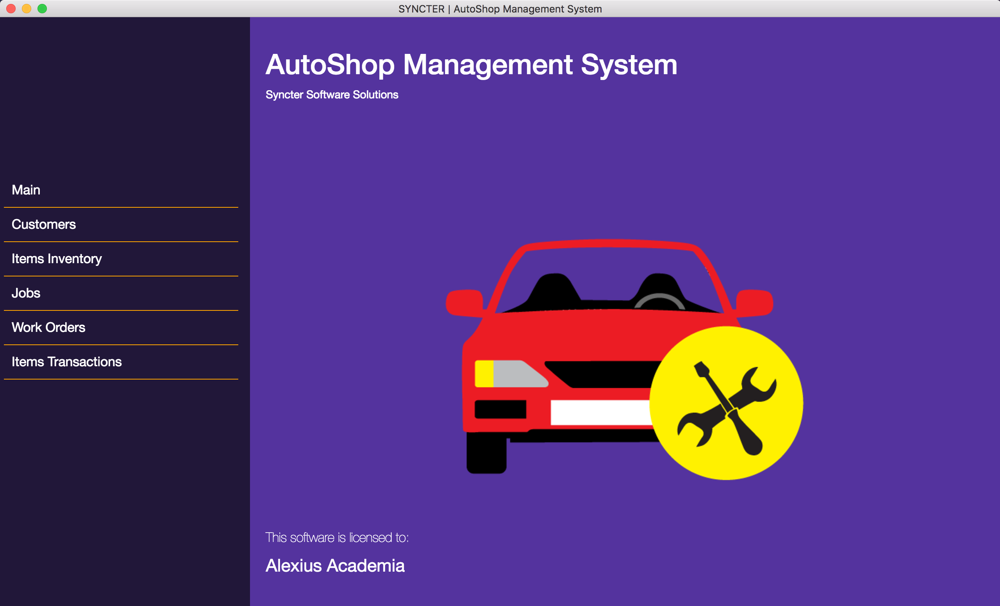

# Autoshop Management System
A desktop software for automotive shop management created using atom electron. This project is to demonstrate creating desktop application using web technologies.

This app uses the module [electron-db](https://github.com/alexiusacademia/electron-db) store data locally and immitate a database-like storage.

### App Features:
- [x] Add/View Customer Details
- [ ] Update Customer Details
- [x] View Customers List
- [x] Add Vehicle
- [ ] View Vehicle
- [ ] Update Vehicle Information
- [x] Create Work Order
- [ ] View List of Work Orders
- [ ] Add/View/Update Item
- [ ] Add/View Item Transaction
- [ ] View Sales
- [x] Add item
- [x] Update item
- [x] View Items Inventory/List
- [x] Add Job
- [x] View Job List
- [ ] Update Job
- [ ] Print Report

### Contribute
Contributors are welcome in the project.
You may contact me at alexius.academia@gmail.com
